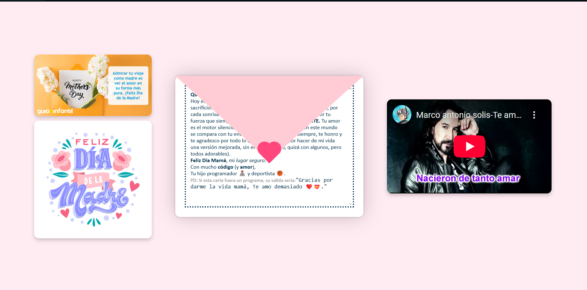

# Letter Love - Interactive Digital Card for Mother's Day



> An interactive digital card that beautifully expresses love and appreciation for mothers through an animated envelope experience.

## 🌟 Features

- **Interactive Envelope Animation**: Engaging envelope that opens and closes with beautiful animations
- **Personalized Message**: Heartfelt message displayed inside the card with styled text
- **Media Integration**: Images and embedded video for a rich multimedia experience
- **Clean UI**: Elegant and intuitive user interface with thoughtful design elements

## 🛠️ Technology Stack

This project leverages modern web technologies for optimal performance and user experience:

- **[Next.js 15](https://nextjs.org/)**: React framework with App Router for improved performance and routing
- **[React 19](https://react.dev/)**: For building interactive user interfaces
- **[TypeScript](https://www.typescriptlang.org/)**: For type-safe code and improved developer experience
- **[Tailwind CSS 4](https://tailwindcss.com/)**: For utility-first styling with the latest features
- **[Framer Motion](https://www.framer.com/motion/)**: For smooth animations and transitions
- **[Swiper](https://swiperjs.com/)**: For touch-enabled slider components
- **[TurboPack](https://turbo.build/pack)**: For lightning-fast development experience

## 🚀 Getting Started

### Prerequisites

- Node.js 18.x or later
- npm, yarn, pnpm, or bun package manager

### Installation

1. Clone the repository:

```bash
git clone https://github.com/AnderssonProgramming/letter-love.git
cd letter-love
```

2. Install dependencies:

```bash
npm install
# or
yarn install
# or
pnpm install
# or
bun install
```

3. Start the development server:

```bash
npm run dev
# or
yarn dev
# or
pnpm dev
# or
bun dev
```

4. Open [http://localhost:3000](http://localhost:3000) in your browser to see the application.

## 📝 Customization

You can easily personalize this digital card:

- Modify the message content in `src/app/components/Carta.tsx`
- Update images and videos with your own media files
- Customize colors and styling in `src/app/styles/globals.css`
- Add additional animations or interactions using Framer Motion

## 🌐 Deployment

This application can be easily deployed using Vercel:

[](https://vercel.com/new/clone?repository-url=https%3A%2F%2Fgithub.com%2Fyour-username%2Fletter-love)

For other deployment options, check the [Next.js deployment documentation](https://nextjs.org/docs/app/building-your-application/deploying).

## 💡 Use Cases

- **Mother's Day Celebrations**: Send a digital card that stands out with interactive elements
- **Birthday Wishes**: Personalize the content for birthday celebrations
- **Anniversary Greetings**: Express love to your partner on special occasions
- **Thank You Notes**: Show appreciation in a memorable way
- **Event Invitations**: Adapt the envelope concept for event invitations

## 🔮 Future Enhancements

- Email integration to send the digital card directly
- Multiple card themes and designs
- Audio messages and background music
- Save and share functionality
- Custom confetti or particle effects when opening the card

## 👨‍💻 Author

Created with ❤️ by Andersson Sanchez

---

*This project is built to showcase the power of modern web technologies in creating meaningful digital experiences. Feel free to contribute, share, and adapt for your own purposes!*

